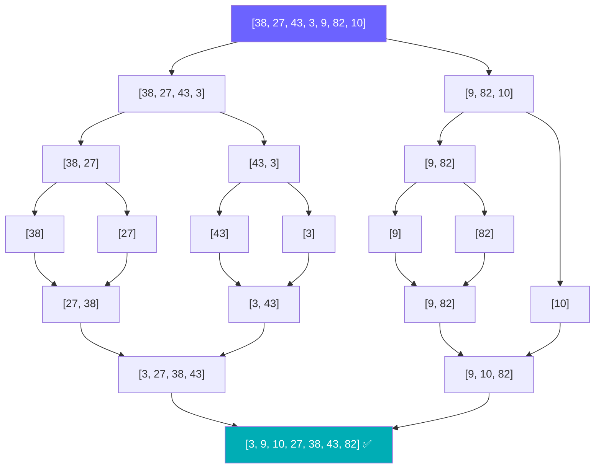
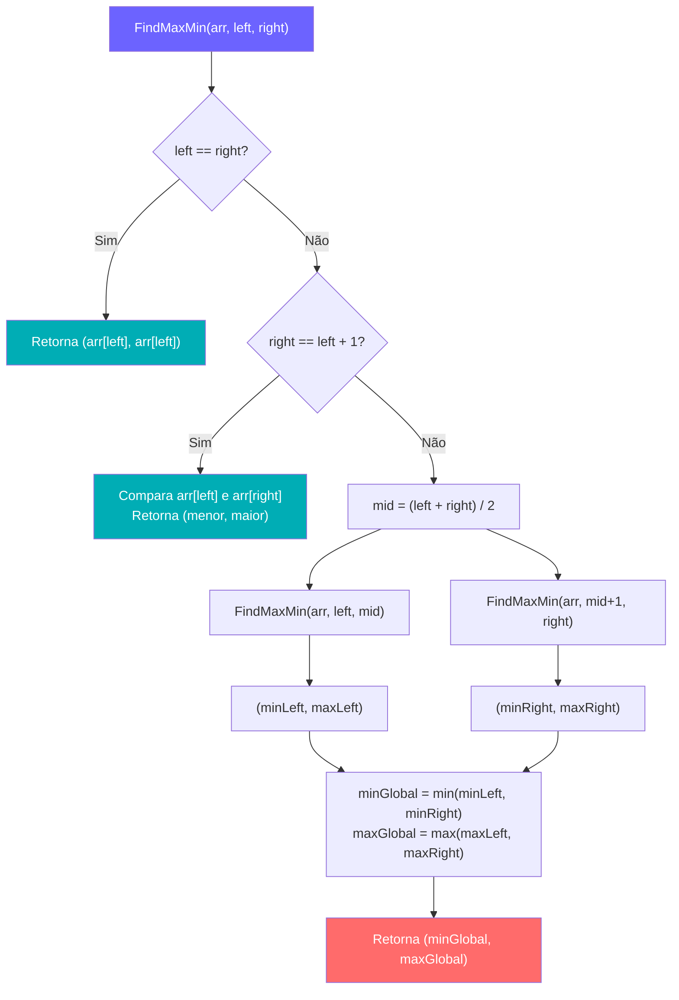
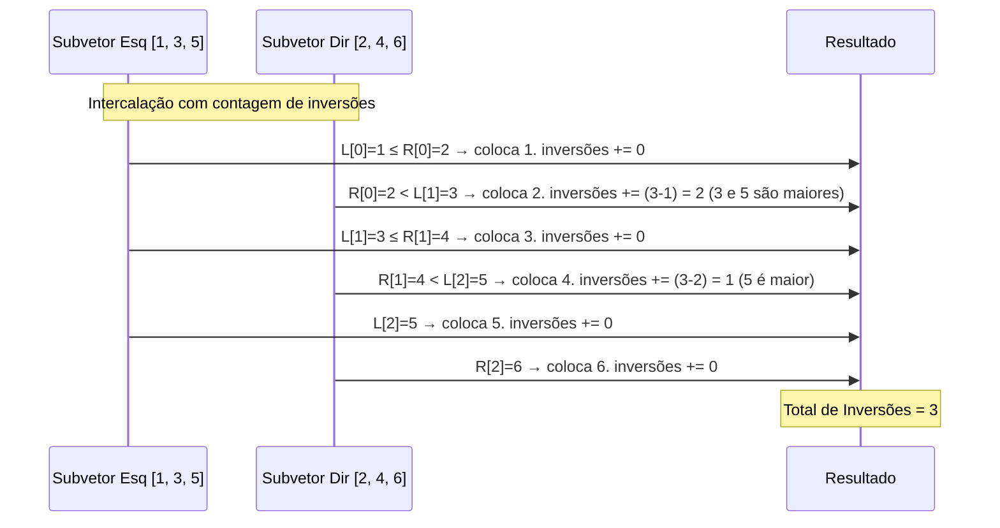

<div align="center">

# 🔬 Análise e Complexidade de Algoritmos
### Trabalho Final — Divisão e Conquista

[](https://learn.microsoft.com/en-us/dotnet/csharp/)
[](https://github.com/migueltotti/Trabalho_Final_Analise_Complexidade_Algoritmos)
[](https://github.com/migueltotti/Trabalho_Final_Analise_Complexidade_Algoritmos)
[-FF6B6B?style=for-the-badge)](https://github.com/migueltotti/Trabalho_Final_Analise_Complexidade_Algoritmos)

<br/>

> *"Dividir para conquistar: o princípio por trás dos algoritmos mais elegantes da Ciência da Computação."*

</div>

---

## 📑 Índice

- [Sobre o Projeto](#-sobre-o-projeto)
- [Estrutura do Repositório](#-estrutura-do-repositório)
- [Parte 1 — MergeSort vs. Inserção](#-parte-1--mergesort-vs-ordenação-por-inserção)
- [Parte 2 — Máximo e Mínimo Simultâneo](#-parte-2--máximo-e-mínimo-simultâneo-divisão-e-conquista)
- [Parte 3 — Contagem de Inversões](#-parte-3--desafio-de-programação-competitiva-contagem-de-inversões)
- [Resultados e Conclusões](#-resultados-e-conclusões)
- [Equipe](#-equipe)

---

## 🎯 Sobre o Projeto

Este repositório contém o **Trabalho Final** da disciplina de **Análise e Complexidade de Algoritmos**, com foco no paradigma de **Divisão e Conquista**. O trabalho é dividido em três partes independentes, cada uma implementada em **C#**, abordando um problema clássico com análise teórica e implementação prática.

### Objetivos

- ✅ Implementar o MergeSort e compará-lo empiricamente com a Ordenação por Inserção (Grupo 1) para vetores de até **10 milhões de elementos**
- ✅ Projetar um algoritmo original de divisão e conquista para encontrar máximo e mínimo simultaneamente, com análise formal de recorrência
- ✅ Resolver um desafio de programação competitiva — Contagem de Inversões — com complexidade ótima **O(n log n)**, incluindo comparação com força bruta O(n²)

---

## 📁 Estrutura do Repositório

```
📦 Trabalho_Final_Analise_Complexidade_Algoritmos/
├── 📄 MergeSort.cs            # Parte 1: MergeSort com comparação empírica (3 cenários)
├── 📄 FindMinMax.cs           # Parte 2: Algoritmo D&C para máximo e mínimo simultâneo
├── 📄 ContagemInversoes.cs    # Parte 3: MergeSort modificado + Força Bruta para inversões
└── 📄 README.md
```

---

## 🔀 Parte 1 — MergeSort vs. Ordenação por Inserção

**Arquivo:** [`MergeSort.cs`](./MergeSort.cs)

### Visão Geral

Implementamos o **MergeSort** e medimos empiricamente o tempo de execução em **três cenários** com vetores de **10.000.000 de elementos**, comparando os resultados com o algoritmo de Ordenação por Inserção do Grupo 1.

Os cenários de teste gerados pelo `gerarVetor()`:

| Caso | Descrição | Tipo de vetor gerado |
|:----:|:----------|:---------------------|
| **Melhor Caso** | Vetor já ordenado crescentemente | `vetor[i] = i + 1` |
| **Pior Caso** | Vetor ordenado de forma decrescente | `vetor[i] = tamanho - i` |
| **Caso Médio** | Vetor com valores aleatórios | `rnd.Next(1, tamanho)` |

### Como funciona o MergeSort



### Análise de Complexidade

| Caso | Inserção | MergeSort |
|:----:|:--------:|:---------:|
| **Melhor** | O(n) | O(n log n) |
| **Médio** | O(n²) | O(n log n) |
| **Pior** | O(n²) | O(n log n) |

> O MergeSort possui complexidade **garantida** de O(n log n) em todos os casos, enquanto a Inserção degrada para O(n²) no caso médio e pior.

### Recorrência

$$T(n) = 2T\!\left(\frac{n}{2}\right) + \Theta(n)$$

Resolvida pelo **Teorema Mestre** (Caso 2):

- $a = 2$, $b = 2$, $f(n) = \Theta(n)$, $n^{\log_2 2} = n$
- Como $f(n) = \Theta(n^{\log_b a})$ → **Caso 2** → $T(n) = \Theta(n \log n)$

---

## 🎯 Parte 2 — Máximo e Mínimo Simultâneo (Divisão e Conquista)

**Arquivo:** [`FindMinMax.cs`](./FindMinMax.cs)

### Descrição do Problema

Dado um vetor $A$ de $n$ inteiros, encontrar o **máximo** e o **mínimo** simultaneamente com o menor número possível de comparações.

A função implementada retorna uma tupla `(int min, int max)` e lida com três situações:

```csharp
// Caso base 1: único elemento
if (left == right) return (arr[left], arr[right]);

// Caso base 2: dois elementos — uma única comparação
if (right == left + 1) { ... }

// Recursão: divide ao meio, conquista, combina
int mid = (left + right) / 2;
var (minLeft, maxLeft)  = FindMaxMin(arr, left, mid);
var (minRight, maxRight) = FindMaxMin(arr, mid + 1, right);
```

### Abordagem Ingênua vs. D&C

| Abordagem | Comparações |
|:----------:|:-----------:|
| Ingênua (2 passagens) | $2(n - 1)$ |
| **D&C (nosso algoritmo)** | $\lceil \frac{3n}{2} \rceil - 2$ |

### Fluxo do Algoritmo



### Análise da Recorrência

$$T(n) = \begin{cases} 0, & n = 1 \\ 1, & n = 2 \\ 2T\!\left(\dfrac{n}{2}\right) + 2, & n > 2 \end{cases}$$

**Resolução por Teorema mestre** 
**Resultado:** T(n) = $\Theta(n)$

---

## 🧮 Parte 3 — Desafio de Programação Competitiva: Contagem de Inversões

**Arquivo:** [`ContagemInversoes.cs`](./ContagemInversoes.cs)

### Definição do Problema

Dado um vetor $A$ de $N$ inteiros, uma **inversão** é um par $(i, j)$ tal que:
$$i < j \quad \text{e} \quad A[i] > A[j]$$

**Restrições:**
- $N \leq 5 \times 10^5$
- $A[i] \in [-10^9, 10^9]$ — exatamente o range usado em `gerarVetorAleatorio()`: `rnd.Next(-1_000_000_000, 1_000_000_000)`

> O programa testa com `tamanho = 50.000` e executa os dois algoritmos sobre o **mesmo vetor** (copiado via `Array.Copy`), garantindo comparação justa.

### Como o MergeSort conta inversões?

A chave está na função `Intercala()`. Quando um elemento do subvetor direito `R[iR]` é menor que o elemento atual do subvetor esquerdo `L[iL]`, **todos** os elementos restantes de `L` (índices `iL` até `n1-1`) são maiores que `R[iR]` e formam inversões com ele:

```csharp
else
{
    A[k] = R[iR];
    iR++;
    inversoes += (n1 - iL); // ← Conta todas as inversões de uma vez!
}
```

O retorno acumulado propaga as contagens pela recursão:

```csharp
static long MergeSort(int[] A, int p, int r)
{
    long contador = 0;
    if (p < r)
    {
        int q = (p + r) / 2;
        contador += MergeSort(A, p, q);     // Inversões na metade esquerda
        contador += MergeSort(A, q + 1, r); // Inversões na metade direita
        contador += Intercala(A, p, q, r);  // Inversões entre as metades
    }
    return contador;
}
```

> O uso de `long` (em vez de `int`) é essencial: para $N = 5 \times 10^5$ o número máximo de inversões é $\frac{N(N-1)}{2} \approx 1.25 \times 10^{11}$, que ultrapassa o limite de `int` (≈ $2.1 \times 10^9$).

### Fluxo de Contagem Durante o Merge



### Análise pelo Teorema Mestre

O algoritmo modificado mantém **exatamente a mesma recorrência** do MergeSort original:

$$T(n) = 2T\!\left(\frac{n}{2}\right) + \Theta(n)$$

- $a = 2$, $b = 2$, $f(n) = \Theta(n)$
- $n^{\log_b a} = n^{\log_2 2} = n$
- Como $f(n) = \Theta(n^{\log_b a})$ → **Caso 2 do Teorema Mestre**

$$\boxed{T(n) = \Theta(n \log n)}$$


## 👨‍💻 Equipe

<div align="center">

| Membro | GitHub |
|:------:|:------:|
| Gustavo Azevedo | [@gusta-azv](https://github.com/gusta-azv) |
| Hugo Pereira | [@HugoPereiraP](https://github.com/HugoPereiraP) |
| Miguel Totti | [@migueltotti](https://github.com/migueltotti) |
| Marcus Magri | [@gusta-azv](https://github.com/MarcusMagri) |

</div>

---

<div align="center">

**Disciplina:** Análise e Complexidade de Algoritmos · **Semestre:** 2026.1

<br/>

*Feito com 💜 e muito* `O(n log n)`
*besitos murilão 😘*

</div>
